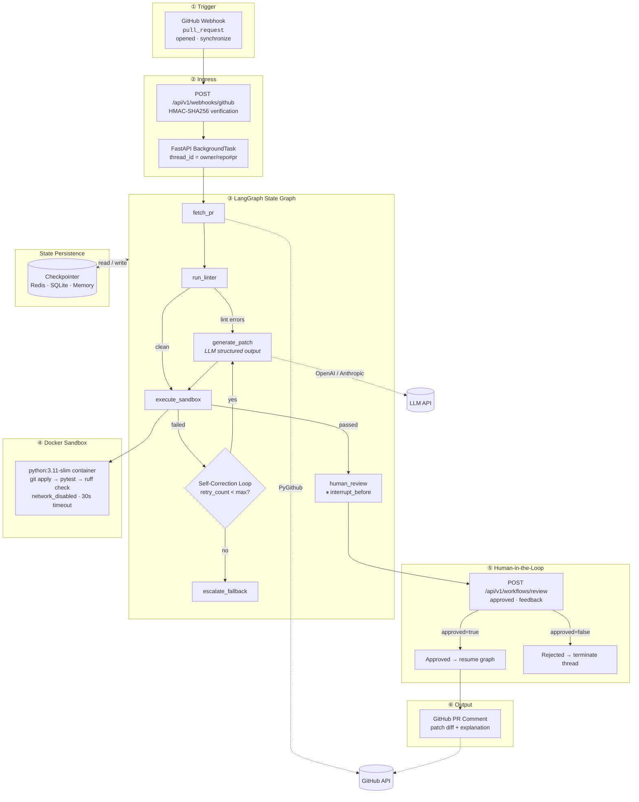

# PatchSentinel: Autonomous AI Code-Review & Self-Healing Patching Agent

[](https://www.python.org/downloads/)
[](https://langchain-ai.github.io/langgraph/)
[](https://fastapi.tiangolo.com/)
[](https://www.docker.com/)
[](https://redis.io/)

> **PatchSentinel** is a production-grade agentic workflow orchestrator that listens for GitHub pull-request events, generates LLM-powered fixes, validates them inside isolated Docker sandboxes, self-corrects on failure, and pauses for human approval before posting patches back to the PR.

Turn static code review into an **autonomous, self-healing execution loop** — with full observability, checkpointed state, and failure handling at every step.

---

## Problem vs. Solution

| Traditional Static Code Review | PatchSentinel Autonomous Loop |
|--------------------------------|-------------------------------|
| Human reads diffs and leaves comments | Webhook triggers a LangGraph state machine automatically |
| Developer manually fixes lint/test failures | LLM generates unified-diff patches from structured diagnostics |
| No verification that suggested fixes actually work | Every patch runs in an ephemeral Docker sandbox (`pytest` + `ruff`) |
| Same mistakes repeated across review rounds | **Self-correction loop** injects prior `stdout`/`stderr` into the next LLM prompt |
| AI-suggested changes can be merged unchecked | **Human-in-the-loop interrupt** blocks PR comments until explicit approval |
| Workflow state lost on process restarts | **Redis / SQLite checkpointers** persist graph state by `thread_id` |
| GitHub & LLM rate limits break pipelines | **Tenacity exponential backoff** on HTTP 429 and 5xx errors |

---

## Architecture

End-to-end flow from webhook ingress through sandbox validation, self-correction, HITL approval, and PR comment publication.



---

## Key Engineering Signals

### State Management & Persistence

PatchSentinel models workflow context in a typed **`AgentState`** (`pr_id`, `repo_name`, `file_changes`, `lint_errors`, `generated_patch`, `test_results`, `retry_count`, `human_approved`, `status`) with LangGraph reducers for accumulating lint errors and incrementing retry counts.

Checkpoints are keyed by `thread_id` (`{repo_name}#{pr_id}`) and configurable via `CHECKPOINT_BACKEND`:

| Backend | Env | Best for |
|---------|-----|----------|
| `memory` | `CHECKPOINT_BACKEND=memory` | Local dev & unit tests |
| `sqlite` | `CHECKPOINT_BACKEND=sqlite` | Single-node persistence |
| `redis` | `CHECKPOINT_BACKEND=redis` | Production multi-worker deployments |

```bash
# docker-compose defaults to Redis
REDIS_URL=redis://redis:6379/0
```

---

### Self-Correction Loops

When sandbox validation fails, PatchSentinel does **not** blindly retry. It:

1. Increments `retry_count` in `AgentState`
2. Routes back to `generate_patch` via `should_retry_or_approve`
3. Injects a **SELF-CORRECTION** block into the LLM prompt containing:
   - Previous `test_results.stdout` and `test_results.stderr`
   - Exit code from the failed run
   - Remaining `lint_errors`

The LLM returns a structured **`PatchOutput`** (Pydantic) with `patch_diff` and `explanation`, ensuring parseable output on every attempt. After `MAX_RETRY_COUNT` failures, the graph routes to `escalate_fallback` for manual triage.

---

### Sandboxed Execution Isolation

`DockerSandboxRunner` validates every patch inside an ephemeral container:

- **Image:** `python:3.11-slim` (or `SANDBOX_IMAGE`)
- **Flow:** shallow-clone on host → mount workspace → `git apply` → `pytest -q` → `ruff check .`
- **Security:** `network_disabled=True`, `cap_drop=["ALL"]`, `no-new-privileges`, 512 MB memory cap
- **Timeout:** hard **30-second** execution limit — container is killed and removed on expiry
- **Cleanup:** force-removed in a `finally` block regardless of outcome

The FastAPI service mounts `/var/run/docker.sock` in production so it can spawn sibling sandbox containers without bundling test dependencies into the app image.

---

### Human-in-the-Loop (HITL) Checkpoints

PatchSentinel compiles the LangGraph with:

```python
graph.compile(
    checkpointer=checkpointer,
    interrupt_before=["human_review"],
)
```

This guarantees **no patch is ever posted to GitHub** until a human explicitly approves via:

```bash
POST /api/v1/workflows/review
{ "thread_id": "acme/widget#42", "approved": true, "feedback": "LGTM" }
```

On approval, the API resumes the graph with `graph.stream(None, config)`, runs the `human_review` node to completion, and posts the approved diff as a formatted PR comment via PyGithub. On rejection, state is set to `"rejected"`, feedback is recorded, and the thread terminates gracefully.

---

### Resiliency & Rate-Limiting

External API calls are wrapped with **`tenacity`** exponential backoff (`@api_retry`):

| Target | Retried conditions | Backoff |
|--------|-------------------|---------|
| GitHub API (`fetch_pull_request_files`, `post_approved_patch_comment`) | HTTP 429, 5xx, `RateLimitExceededException` | 1 s → 60 s, max 5 attempts |
| LLM invocation (`_invoke_patch_llm`) | HTTP 429, 5xx, rate-limit exception types | 1 s → 60 s, max 5 attempts |

Configure max attempts via `API_RETRY_ATTEMPTS=5`.

---

## Quickstart & Local Setup

### Prerequisites

- **Python 3.11+**
- **[uv](https://docs.astral.sh/uv/)** package manager
- **Docker Desktop** (for sandbox execution)
- GitHub PAT with `repo` scope (production use)

### 1. Clone & configure

```bash
git clone https://github.com/your-org/patchsentinel.git
cd patchsentinel

cp .env.example .env
# Edit .env — see Configuration section below
```

### 2. Install dependencies

```bash
uv sync --extra dev
```

### 3. Build the sandbox image

```bash
docker build -f Dockerfile.sandbox -t autopatch-sandbox:latest .
```

### 4. Run locally

```bash
uv run python main.py
```

| Resource | URL |
|----------|-----|
| API server | http://localhost:8000 |
| Interactive docs | http://localhost:8000/docs |
| Health check | http://localhost:8000/api/v1/health |

### 5. Run with Docker Compose (production stack)

```bash
# Build sandbox image (one-time)
docker compose --profile build build sandbox-image

# Start app + Redis
docker compose up -d --build

# Tail logs
docker compose logs -f app
```

The `app` service connects to Redis for checkpointing and mounts the Docker socket to spawn sandbox containers.

---

## API Reference

| Method | Endpoint | Description | Auth | Success Response |
|--------|----------|-------------|------|------------------|
| `GET` | `/api/v1/health` | Liveness probe | None | `200` `{ "status": "ok", "service": "autopatch-agent" }` |
| `POST` | `/api/v1/webhooks/github` | Receive GitHub `pull_request` webhooks | `X-Hub-Signature-256` HMAC | `202` `{ "status": "processing", "thread_id": "owner/repo#17" }` |
| `POST` | `/api/v1/workflows/review` | Submit human approval or rejection | None | `200` `{ "thread_id", "status", "state" }` |

### `POST /api/v1/webhooks/github`

**Headers**

| Header | Required | Description |
|--------|----------|-------------|
| `X-GitHub-Event` | Yes | Must be `pull_request` |
| `X-Hub-Signature-256` | Yes | HMAC-SHA256 of raw body using `GITHUB_WEBHOOK_SECRET` |
| `Content-Type` | Yes | `application/json` |

**Handled actions:** `opened`, `synchronize`

**Extracted fields:** `repo_name`, `pr_id`, `clone_url`, `head_sha`

**Example response**

```json
{
  "status": "processing",
  "thread_id": "acme/widget#17"
}
```

Ignored events return `202` with `{ "status": "ignored", "thread_id": "" }`.

---

### `POST /api/v1/workflows/review`

**Request body**

```json
{
  "thread_id": "acme/widget#42",
  "approved": true,
  "feedback": "LGTM — clean fix"
}
```

| Field | Type | Description |
|-------|------|-------------|
| `thread_id` | `string` | Workflow identifier (`{repo}#{pr_number}`) |
| `approved` | `boolean` | `true` to post patch; `false` to reject |
| `feedback` | `string \| null` | Optional reviewer note stored in state |

**Responses**

| Code | Condition |
|------|-----------|
| `200` | Review processed; graph resumed or terminated |
| `404` | No checkpoint found for `thread_id` |
| `409` | Workflow not in `awaiting_human_review` status |
| `422` | Approved workflow missing `generated_patch` |

---

### `GET /api/v1/health`

```bash
curl http://localhost:8000/api/v1/health
```

```json
{ "status": "ok", "service": "autopatch-agent" }
```

---

## Demo / Dry-Run Guide (No Live API Keys)

You can explore PatchSentinel fully offline using placeholder credentials and the built-in test suite — no OpenAI, Anthropic, or GitHub API calls required.

### Step 1 — Placeholder environment

Create a `.env` with dummy values (satisfies Pydantic validation without calling external APIs):

```bash
cat > .env <<'EOF'
GITHUB_TOKEN=ghp_test_placeholder
GITHUB_WEBHOOK_SECRET=test-webhook-secret
OPENAI_API_KEY=sk-test-placeholder
LLM_PROVIDER=openai
CHECKPOINT_BACKEND=memory
EOF
```

### Step 2 — Run the offline test suite

The test suite mocks GitHub, Docker, and LLM calls. **No network access needed.**

```bash
uv sync --extra dev
uv run pytest -q
# 64 passed — routing, sandbox, webhooks, HITL, retries, checkpointers
```

### Step 3 — Smoke-test the HTTP layer

Start the server with placeholder env vars:

```bash
uv run python main.py
```

Hit the health endpoint (no external calls):

```bash
curl http://localhost:8000/api/v1/health
```

### Step 4 — Simulate a signed webhook locally

Generate a valid HMAC signature and POST a mock payload:

```bash
python3 <<'PY'
import hashlib, hmac, json, urllib.request

secret = "test-webhook-secret"
payload = {
    "action": "opened",
    "repository": {"full_name": "acme/widget"},
    "pull_request": {
        "number": 42,
        "head": {
            "sha": "abc123",
            "repo": {"clone_url": "https://github.com/acme/widget.git"},
        },
    },
}
body = json.dumps(payload).encode()
sig = "sha256=" + hmac.new(secret.encode(), body, hashlib.sha256).hexdigest()

req = urllib.request.Request(
    "http://localhost:8000/api/v1/webhooks/github",
    data=body,
    headers={
        "Content-Type": "application/json",
        "X-GitHub-Event": "pull_request",
        "X-Hub-Signature-256": sig,
    },
    method="POST",
)
print(urllib.request.urlopen(req).read().decode())
PY
```

Expected: `{"status":"processing","thread_id":"acme/widget#42"}`

> **Note:** The background workflow will attempt GitHub/Docker/LLM calls unless those services are mocked. For a fully offline webhook demo, rely on the pytest suite (`tests/test_api_routes.py`), which patches `_run_workflow` and external integrations.

### Step 5 — Dry-run HITL review (via tests)

The HITL resumption flow is covered in tests that seed an interrupted graph state in memory and call `/api/v1/workflows/review` without live services:

```bash
uv run pytest tests/test_api_routes.py -v
```

---

## Configuration

| Variable | Default | Description |
|----------|---------|-------------|
| `GITHUB_TOKEN` | — | GitHub PAT for API access |
| `GITHUB_WEBHOOK_SECRET` | — | HMAC secret for webhook verification |
| `OPENAI_API_KEY` | — | Required when `LLM_PROVIDER=openai` |
| `ANTHROPIC_API_KEY` | — | Required when `LLM_PROVIDER=anthropic` |
| `LLM_PROVIDER` | `openai` | `openai` or `anthropic` |
| `LLM_MODEL` | `gpt-4o` | Model name for patch generation |
| `CHECKPOINT_BACKEND` | `memory` | `memory`, `sqlite`, or `redis` |
| `REDIS_URL` | `redis://localhost:6379/0` | Redis URL for checkpointing |
| `CHECKPOINT_DB_URL` | `sqlite:///./data/checkpoints.db` | SQLite path when backend=sqlite |
| `MAX_RETRY_COUNT` | `3` | Self-correction attempts before escalation |
| `SANDBOX_IMAGE` | `autopatch-sandbox:latest` | Docker image for validation |
| `API_RETRY_ATTEMPTS` | `5` | Max tenacity retries for 429/5xx |

---

## Project Structure

```
patchsentinel/
├── main.py                          # FastAPI entrypoint
├── docker-compose.yml               # App + Redis orchestration
├── Dockerfile                       # Production app image
├── Dockerfile.sandbox               # Isolated pytest/ruff environment
├── src/autopatch_agent/
│   ├── config.py                    # Pydantic settings
│   ├── state.py                     # AgentState TypedDict + reducers
│   ├── graph.py                     # StateGraph builder + checkpointer factory
│   ├── edges.py                     # should_retry_or_approve routing
│   ├── sandbox.py                   # DockerSandboxRunner (30s timeout)
│   ├── resilience/retry.py          # Tenacity @api_retry decorator
│   ├── services/github.py           # GitHub API with backoff
│   ├── nodes/                       # fetch_pr · run_linter · generate_patch · …
│   └── api/routes.py                # Webhook + HITL endpoints
└── tests/                           # 64 unit & integration tests
```

---

## Tech Stack

| Layer | Technology |
|-------|------------|
| Orchestration | LangGraph `StateGraph` with conditional edges |
| API | FastAPI + Uvicorn |
| LLM | OpenAI / Anthropic via LangChain structured output |
| Sandbox | Docker SDK (`python:3.11-slim`) |
| VCS Integration | PyGithub |
| Persistence | Redis · SQLite · in-memory checkpointers |
| Resiliency | Tenacity exponential backoff |
| Packaging | uv · Docker Compose |

---

## License

MIT
